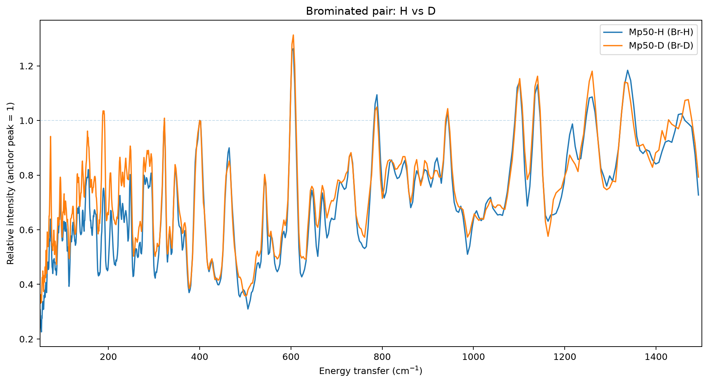
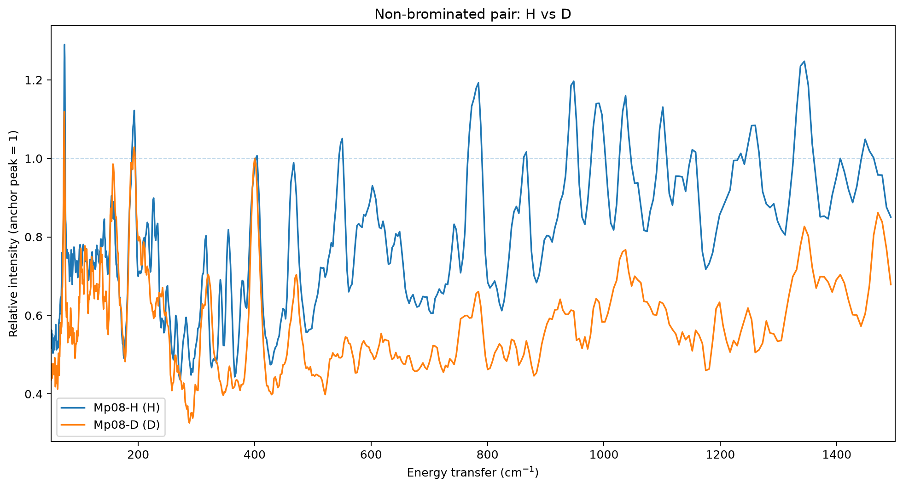

# Gallium – Peter Sadler TOSCA spectra

Reproducible processing archive for four gallium complex spectra measured on TOSCA.

## Samples

| Compound | Dataset | Variant | MW (g mol⁻¹) | Mass (mg) |
|---|---|---|---:|---:|
| Mp50-H | Br-H | brominated, protiated | 591.85 | 171 |
| Mp50-D | Br-D | brominated, deuterated | 595.95 | 97 |
| Mp08-H | H | non-brominated, protiated | 452.07 | 83 |
| Mp08-D | D | non-brominated, deuterated | 456.10 | 43 |

The raw empty aluminium cell and short empty-cryostat measurements are also preserved.

## Final relative-shape processing pipeline

1. **Preserve raw data unchanged.**
2. Apply a **centred 5-point moving average** to the empty aluminium spectrum.
3. Subtract this smoothed aluminium background from each sample.
4. Identify the common ~400 cm⁻¹ anchor position as the sampled local maximum in **350–430 cm⁻¹**.
5. Apply a **centred 3-point moving average** to each aluminium-subtracted sample spectrum.
6. **Normalize once** by the 3-point-smoothed intensity at that fixed anchor position, so the anchor is exactly 1.0.
7. Form deuteration difference spectra as **H − D** separately for the brominated and non-brominated pairs.

### Anchor positions

| Dataset | Compound | Anchor |
|---|---|---:|
| Br-H | Mp50-H | 400.098 cm⁻¹ |
| Br-D | Mp50-D | 400.098 cm⁻¹ |
| H | Mp08-H | 402.098 cm⁻¹ |
| D | Mp08-D | 400.098 cm⁻¹ |

## Mass-normalised data

A separate mass-normalised branch is retained for absolute-intensity comparison. It is **not used as an input to the final relative-shape normalization**, because dividing a spectrum by its mass is only a constant scale factor and therefore cancels when that same spectrum is divided by its own ~400 cm⁻¹ anchor intensity.

## Cryostat data

`raw/emptycryo.dat` is retained. We explored centred **9-point** and **19-point** averages of this short run, stored in `processed/exploratory_cryo/`. No cryostat contribution is subtracted from the final spectra.

## Repository structure

```text
raw/                              original .dat files, unchanged
metadata/                         masses, formulas, anchor positions
processed/
  01_aluminium_5pt/               smoothed empty-Al background
  02_al_subtracted/               sample - smoothed empty Al
  03_mass_normalised/             separate absolute-intensity branch
  04_three_point_smoothed/        3-point smoothing before normalization
  05_final_anchor_normalised/     final spectra; one normalization only
  06_difference/                  H - D difference spectra
  exploratory_cryo/               9- and 19-point cryostat smooths; not final
plots/                            final comparison and difference PNGs
dashboard/                        static dashboard for GitHub Pages
scripts/process_spectra.py        reproducible processing script
```

## Main comparison plots





## Reproducing the processing

```bash
python -m pip install -r requirements.txt
python scripts/process_spectra.py
```

The script recreates every derived numerical stage from the files in `raw/`.

## Dashboard

The live dashboard is available via GitHub Pages and presents the two final H/D comparison plots first.
